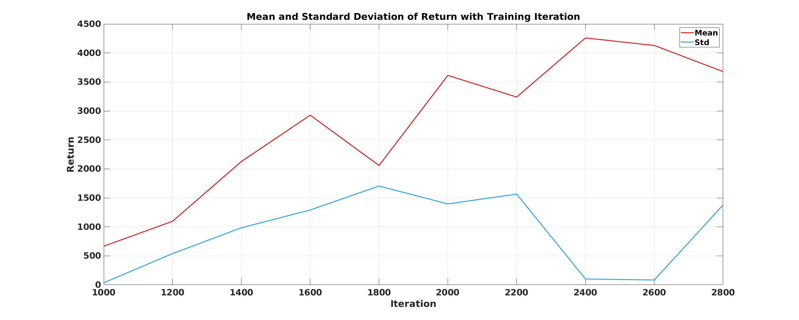
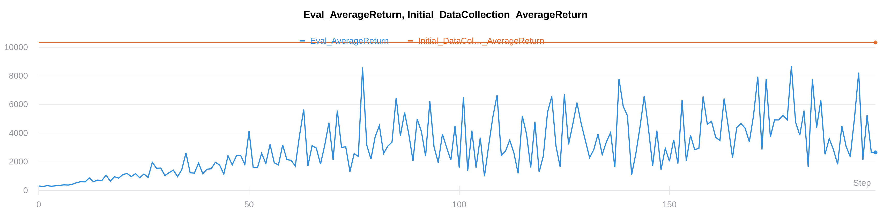

Berkeley CS285 HW1
==================
# This document does not fully satisfy the elements required in the instruction. It is just for self-organization purpose.
## Section 1
### 2. Run behavioral cloning (BC) and report results on two tasks: one task where a behavioral cloning agent achieves at least 30% of the performance of the expert, and one task where it does not. When providing results, report the mean and standard deviation of the return over multiple rollouts in a table, and state which task was used. Be sure to set up a fair comparison, in terms of network size, amount of data, and number of training iterations, and provide these details (and any others you feel are appropriate) in the table caption.

.center[Behavior Cloning of Ant]

The result of behavior cloning with 'Ant-v2' environent is shown as above. The only change from default setting is that 'num_agent_train_steps_per_iter' is set as 2000.
Average return of expert is 4713.653(Initial_DataCollection_AverageReturn) and the policy trained with behavior cloning accomplishes average return of 3613.055 with standand devidation of 1395.815(from 5 evaluation episodes).

The result of behavior cloning with 'Humanoid-v2' environent is shown as above. Size of MLP is changed from 64 to 128 compared to 'Ant-v2' environment, considering higher dimension of observation and action space. 'num_agent_train_steps_per_iter' is set as 2000 as before. 
Average return of expert is 10344.518(Initial_DataCollection_AverageReturn), but the policy trained with behavior cloning only acheives 299.28 with 30.846 standard deviation. 

### 3. Experiment with one set of hyperparameter that affects the performance of the behavioral cloning agent, such as the number of demonstrations, the number of training epochs, the variance of the expert policy, or something that you come up with yourself. For one of the tasks used in the previous question, show a graph of how the BC agent’s performance varies with the value of this hyperparameter, and state the hyperparameter and a brief rationale for why you chose it in the caption for the graph.

Figure above is the mean and standard deviation of ant behavior cloning agent return as training iteration changes. As the training iteration changes from 1000 to 2400, return tends to increase. At iteration 2400, the mean return is peak and std is lowest. As iteration increases from 2400, it seems the agent has been overfitted to training policy.

---------------------------------------
## Section 2

### 2. Run DAgger and report results on one task in which DAgger can learn a better policy than behavioral cloning. Report your results in the form of a learning curve, plotting the number of DAgger iterations vs. the policy’s mean return, with error bars to show the standard deviation. Include the performance of the expert policy and the behavioral cloning agent on the same plot. In the caption, state which task you used, and any details regarding network architecture, amount of data, etc. (as in the previous section).

Humanoid policy trained with DAgger algorithm is multi later fully connected policy with 2 hidden layers and 64 hidden neurons. Return of expert policy is above 10000 and DAgger policy achieves maximum of around 8000. DAgger preety improves performance compared to simple behavior cloning by sampling trajectory from trained policy then relabelling from expert so that the training data distribution matches test data distribution.
