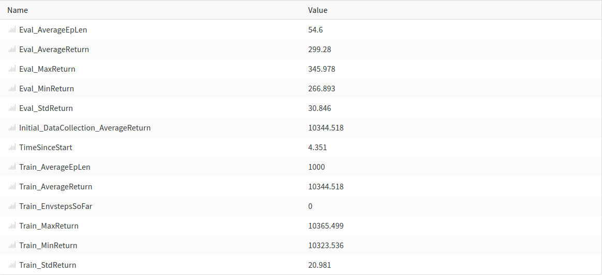

Berkeley CS285 HW1
==================

**2. Run behavioral cloning (BC) and report results on two tasks: one task where a behavioral cloning
agent achieves at least 30% of the performance of the expert, and one task where it does not. When
providing results, report the mean and standard deviation of the return over multiple rollouts in a
table, and state which task was used. Be sure to set up a fair comparison, in terms of network size,
amount of data, and number of training iterations, and provide these details (and any others you feel
are appropriate) in the table caption.**

 The result of behavior cloning with 'Ant-v2' environent is shown as above. The only change from default setting is that 'num_agent_train_steps_per_iter' is set as 2000.
Average return of expert is 4713.653(Initial_DataCollection_AverageReturn) and the policy trained with behavior cloning accomplishes average return of 3613.055 with standand devidation of 1395.815(from 5 evaluation episodes).
 

 The result of behavior cloning with 'Humanoid-v2' environent is shown as above. Size of MLP is changed from 64 to 128 compared to 'Ant-v2' environment, considering higher dimension of observation and action space. 'num_agent_train_steps_per_iter' is set as 2000 as before.
 Average return of expert is 10344.518(Initial_DataCollection_AverageReturn), but the policy trained with behavior cloning only acheives 299.28 with 30.846 standard deviation. 
