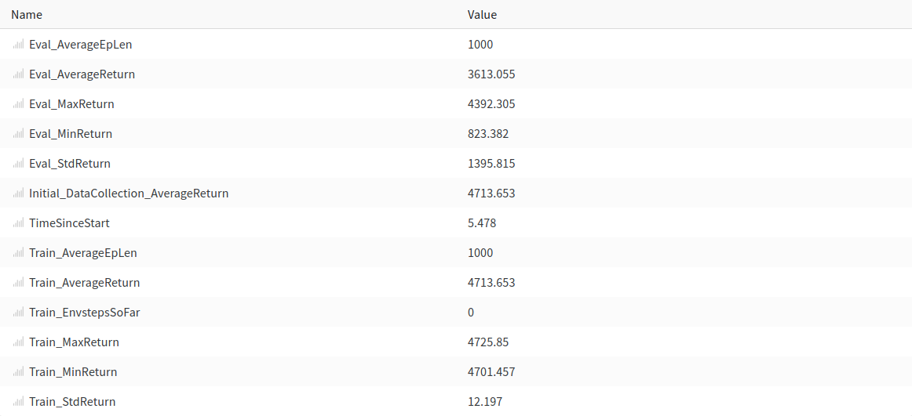

Berkeley CS285 HW1
==================

## 2. Run behavioral cloning (BC) and report results on two tasks: one task where a behavioral cloning
## agent achieves at least 30% of the performance of the expert, and one task where it does not. When
## providing results, report the mean and standard deviation of the return over multiple rollouts in a
## table, and state which task was used. Be sure to set up a fair comparison, in terms of network size,
## amount of data, and number of training iterations, and provide these details (and any others you feel
## are appropriate) in the table caption.

