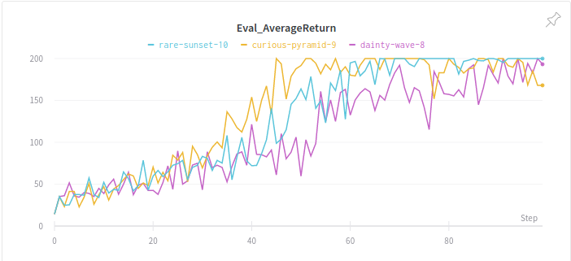
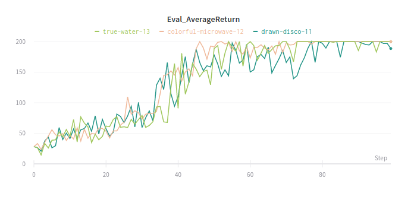
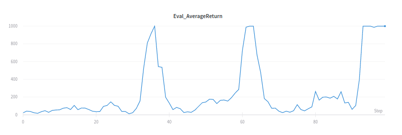
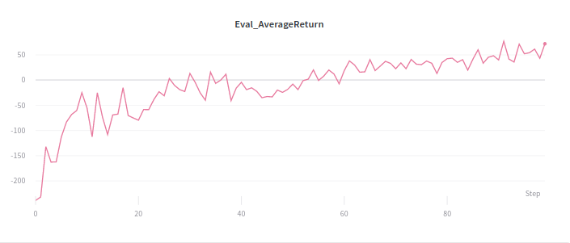
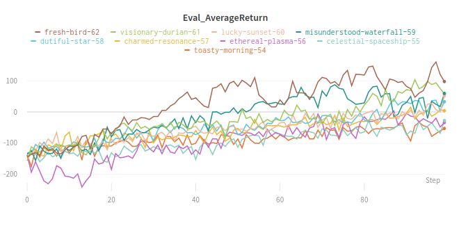
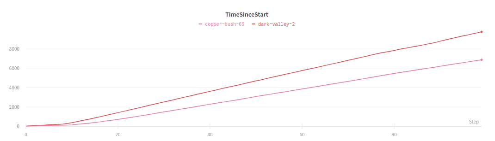

Berkeley CS285 HW2
==================
# This document does not fully satisfy the elements required in the instruction. It is just for self-organization purpose.
## Problem 3
### Create two graphs:

#### - In the first graph, compare the learning curves (average return at each iteration) for the experiments prefixed with sb_. (The small batch experiments.)

dainty-wave-8 : python run_hw2_policy_gradient.py --env_name CartPole-v0 -n 100 -b 1000 -dsa --n_layers 1 --size 32 --use_wandb 1 --n_worker 1 --render_after_training 0 --exp_name sb_no_rtg_dsa

curious-pyramid-9 : python run_hw2_policy_gradient.py --env_name CartPole-v0 -n 100 -b 1000 -rtg -dsa --n_layers 1 --size 32 --use_wandb 1 --n_worker 1 --render_after_training 0 --exp_name sb_rtg_dsa

rare-sunset-10 : python run_hw2_policy_gradient.py --env_name CartPole-v0 -n 100 -b 1000 --n_layers 1 --size 32 --use_wandb 1 --n_worker 1 --render_after_training 0 --exp_name sb_rtg_na

• -n : Number of iterations.

• -b : Batch size (number of state-action pairs sampled while acting according to the
current policy at each iteration).

• -dsa : Flag: if present, sets standardize_advantages to False. Otherwise, by
default, standardize_advantages=True.

• -rtg : Flag: if present, sets reward_to_go=True. Otherwise, reward_to_go=False
by default.

• --exp_name : Name for experiment, which goes into the name for the data logging
directory.

#### – In the second graph, compare the learning curves for the experiments prefixed with lb_. (The large batch experiments.)

drawn-disco-11 : python run_hw2_policy_gradient.py --env_name CartPole-v0 -n 100 -b 5000 -dsa --n_layers 1 --size 32 --use_wandb 1 --n_worker 1 --render_after_training 0 --exp_name lb_no_rtg_dsa

colorful-microwave-12 : python rrun_hw2_policy_gradient.py --env_name CartPole-v0 -n 100 -b 5000 -rtg -dsa --n_layers 1 --size 32 --use_wandb 1 --n_worker 1 --render_after_training 0 --exp_name lb_rtg_dsa

true-water-13 : python run_hw2_policy_gradient.py --env_name CartPole-v0 -n 100 -b 5000 --n_layers 1 --size 32 --use_wandb 1 --n_worker 1 --render_after_training 0 --exp_name lb_rtg_na

• -n : Number of iterations.

• -b : Batch size (number of state-action pairs sampled while acting according to the
current policy at each iteration).

• -dsa : Flag: if present, sets standardize_advantages to False. Otherwise, by
default, standardize_advantages=True.

• -rtg : Flag: if present, sets reward_to_go=True. Otherwise, reward_to_go=False
by default.

• --exp_name : Name for experiment, which goes into the name for the data logging
directory.

### Answer the following questions briefly:

#### – Which value estimator has better performance without advantage-standardization: the trajectory-centric one, or the one using reward-to-go?

    A : Reward-to-go
  
#### – Did advantage standardization help?

    A : No. Actually for small batch experiment, standardizing advantage degraded the performance.
  
#### – Did the batch size make an impact?

    A : Yes, larger batch size improved the performance.
---------------------------------------
## Problem 4
### InvertedPendulum:
#### Find the smallest batch size b* and largest learning rate r* that gets to optimum (maximum score of 1000) in less than 100 iterations

python run_hw2_policy_gradient.py --env_name InvertedPendulum-v2 --ep_len 1000 --discount 0.9 -n 100 -l 2 -s 64 -b 1000 -lr 0.015 -rtg --use_wandb 1 --render_after_training 1 --n_worker 1 --exp_name ip_b1000_r0.015

---------------------------------------
## Problem 6
### LunarLander: 
#### Plot a learning curve for the above command. You should expect to achieve an average return of around 180.

However, it does not reach reward of 180 and the agent has learn to float over the goal position. Something seems wrong.

---------------------------------------
## Problem 7
### HalfCheetah: 
#### Provide a single plot with the learning curves for the HalfCheetah experiments over batch sizes b ∈ [10000, 30000, 50000] and learning rates r ∈ [0.005, 0.01, 0.02]. Also, describe in words how the batch size and learning rate affected task performance.

- fresh-bird-62 : batch size 50000, learning rate 0.02
- visionary-durian-61 : batch size 50000, learning rate 0.01
- lucky-sunset-60 : batch size 50000, learning rate 0.005
- misunderstood-waterfall-59 : batch size 30000, learning rate 0.02
- dutiful-star-58 : batch size 30000, learning rate 0.01
- charmed-resonance-57 : batch size 30000, learning rate 0.005
- ethereal-plasma-56 : batch size 10000, learning rate 0.02
- celestial-spaceship-55 : batch size 10000, learning rate 0.01
- toasty-morning-54 : batch size 10000, learning rate 0.005

In general, larget batch size and higher learning rate accompished better performance. The best performance was accompished with batch size 50000 and learning rate 0.02

#### Provide a single plot with the learning curves for four runs below. The run with both reward-to-go and the baseline should achieve an average score close to 200.

• python run_hw2_policy_gradient.py --env_name HalfCheetah-v2 --ep_len 150 --discount 0.95 -n 100 -l 2 -s 32 -b <b*> -lr <r*> --exp_name hc_b<b*>_r<r*>

• python run_hw2_policy_gradient.py --env_name HalfCheetah-v2 --ep_len 150 --discount 0.95 -n 100 -l 2 -s 32 -b <b*> -lr <r*> -rtg --exp_name hc_b<b*>_r<r*>

• python run_hw2_policy_gradient.py --env_name HalfCheetah-v2 --ep_len 150 --discount 0.95 -n 100 -l 2 -s 32 -b <b*> -lr <r*> --nn_baseline --exp_namehc_b<b*>_r<r*>

• python run_hw2_policy_gradient.py --env_name HalfCheetah-v2 --ep_len 150 --discount 0.95 -n 100 -l 2 -s 32 -b <b*> -lr <r*> -rtg --nn_baseline --exp_name hc_b<b*>_r<r*>

---------------------------------------
## Bonus!
### A serious bottleneck in the learning, for more complex environments, is the samplecollection time. In infrastructure/rl trainer.py, we only collect trajectories in a single thread, but this process can be fully parallelized across threads to get a useful speedup. Implement the parallelization and report on the difference in training time.

The comparision was held with LunarLander environment handled in problem 6. MultiProccesing module was used to parralelize sampling reffering to OpenAI baseline SubprocVecEnv. 16 independent enviroments with workers are created parralelly thus shorten sampling time.

### Implement GAE-λ for advantage estimation. 1 Run experiments in a MuJoCo gym environment to explore whether this speeds up training. (Walker2d-v1 may be good for this.)

### In PG, we collect a batch of data, estimate a single gradient, and then discard the data and move on. Can we potentially accelerate PG by taking multiple gradient descent steps with the same batch of data? Explore this option and report on your results.Set up a fair comparison between single-step PG and multi-step PG on at least one MuJoCo gym environment.
