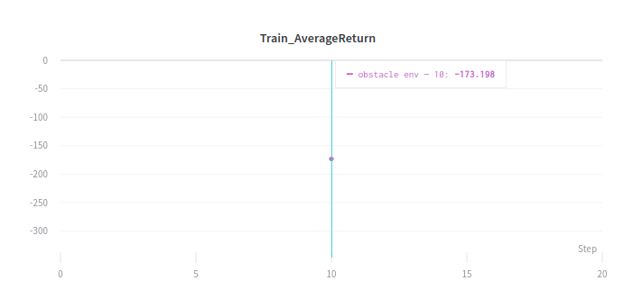

Berkeley CS285 HW4
==================
# This document does not fully satisfy the elements required in the instruction. It is just for self-organization purpose. Also, arguments and codes are modified.
## Problem 1
### MPC With Cheetah Environment

    python cs285/scripts/run_hw4_mb.py --exp_name cheetah_n500_arch1x32 --env_name cheetah-cs285-v0 --add_sl_noise --n_iter 1 --batch_size_initial 20000 --num_agent_train_steps_per_iter 500 --n_layers 1 --size 32 --scalar_log_freq -1 --video_log_freq -1
    python cs285/scripts/run_hw4_mb.py --exp_name cheetah_n5_arch2x250 --env_name cheetah-cs285-v0 --add_sl_noise --n_iter 1 --batch_size_initial 20000 --num_agent_train_steps_per_iter 5 --n_layers 2 --size 250 --scalar_log_freq -1 --video_log_freq -1
    python cs285/scripts/run_hw4_mb.py --exp_name cheetah_n500_arch2x250 --env_name cheetah-cs285-v0 --add_sl_noise --n_iter 1 --batch_size_initial 20000 --num_agent_train_steps_per_iter 500 --n_layers 2 --size 250 --scalar_log_freq -1 --video_log_freq -1

#### - (b) Compare qualitative model prediction plots for the 2 network sizes (runs 1,3)

Size 1x32 and 2x250 neural network for model prediction are compared. Model prediction error of 1x32 network was 1.66 whereas 2x250 network was 0.28. With lareger capacity of network, 2x250 neural network could predict next state more accurate.

#### - (c) Compare qualitative model prediction plots for the 2 of training steps (runs 2,3)

With same size of 2x250, It seems obvious that 500 training step per itertation outperform 5 training step per iteration. 500 training step achieved error of 0.28, whereas 5 training step could only achieve error of 3.25.  

---------------------------------------
## Problem 2
### Action selection using your learned dynamics model and a given reward function.
#### Run MPC algorithm with obstacle environment and compare Train AverageReturn (which was the execution of random actions) to Eval AverageReturn.

---------------------------------------
## Problem 3
### MBRL algorithm with on-policy data collection and iterative model training.
#### Train on our growing replay buffer while collecting new data at each iteration using the most newly trained model.

    python cs285/scripts/run_hw4_mb.py --exp_name obstacles --env_name obstacles-cs285-v0 --add_sl_noise --num_agent_train_steps_per_iter 20 --batch_size_initial 5000 --batch_size 1000 --mpc_horizon 10 --n_iter 12

    python cs285/scripts/run_hw4_mb.py --exp_name reacher --env_name reacher-cs285-v0 --add_sl_noise --mpc_horizon 10 --num_agent_train_steps_per_iter 1000 --batch_size_initial 5000 --batch_size 5000 --n_iter 15

    python cs285/scripts/run_hw4_mb.py --exp_name cheetah --env_name cheetah-cs285-v0 --mpc_horizon 15 --add_sl_noise --num_agent_train_steps_per_iter 1500 --batch_size_initial 5000 --batch_size 5000 --n_iter 20

---------------------------------------
## Problem 4
### MPC Performance with Hyperparameter Variation
#### Compare the performance of your MBRL algorithm as a function of three hyperparameters: the number of models in your ensemble, the number of random action sequences considered during each action selection, and the MPC planning horizon.

• Effect of ensemble size

  The performance increases as the number of ensemble network increases.

• Effect of the number of candidate action sequences

  The performance increases as the number of candidate of action sequences increases.

• Efffect of planning horizon

  It is expected that as the MPC planning horizon increases, the performance should increase. However, as planning horizon increases, the performance gets lower. It seems that since the model has not learned the dynamics thoroughly, the predicted state deviates as the planning horizon increase thus not predicting the reward adequately.
