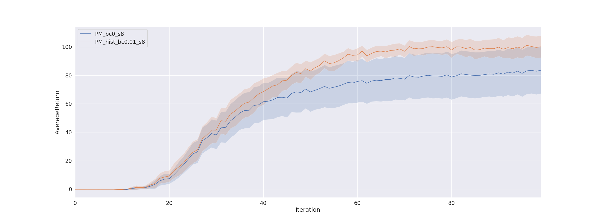
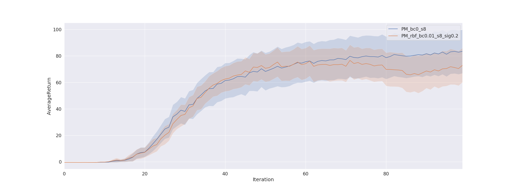
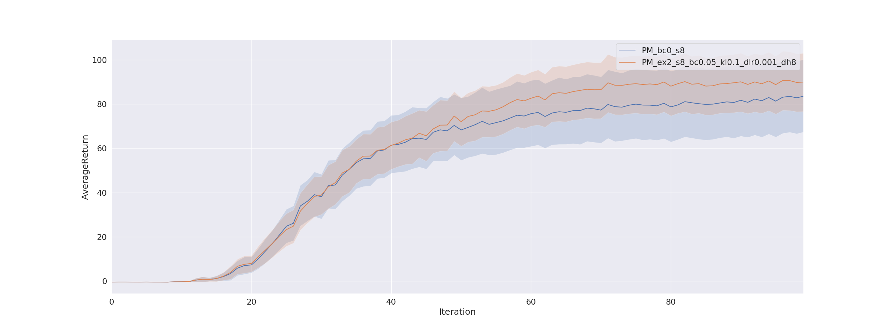
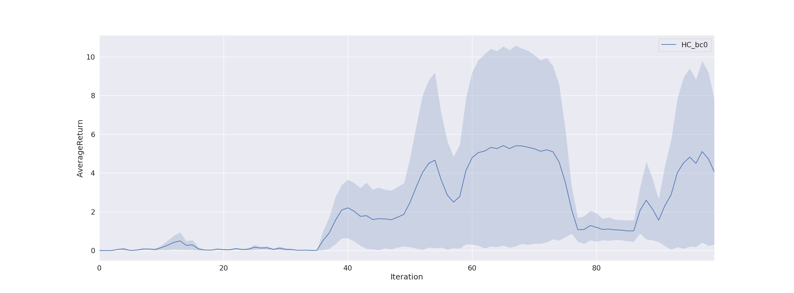
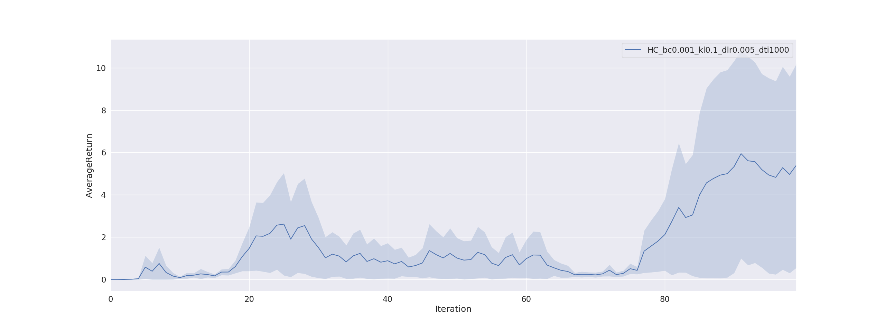
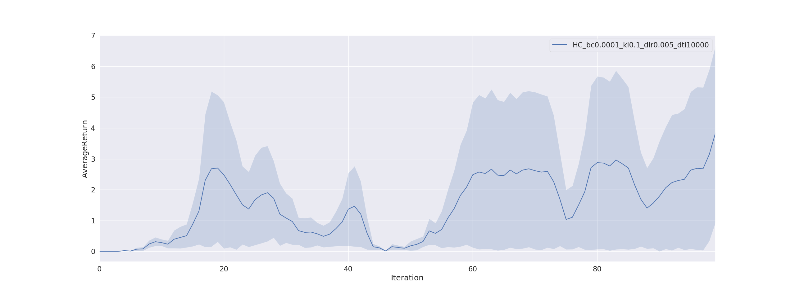

Berkeley CS285 HW5
==================
# This document does not fully satisfy the elements required in the instruction. It is just for self-organization purpose. Also, arguments and codes are modified.
## Problem 1
### The reward modification, the count-based reward bonus and the histogram density model.
#### - Plot 2 curves comparing an agent with histogram based exploration and an agent with no exploration

The results above are run with 8 random seeds. It satisfies reference solutions of mean and standard deviation given in the intruction.
---------------------------------------
## Problem 2
### The heuristic reward bonus and the kernel density estimator with the radial basis function kernel
#### Plot 2 curves comparing an agent with KDE based exploration and an agent with no exploration.

The results above are run with 8 random seeds. It satisfies reference solutions of mean and standard deviation given in the intruction.
---------------------------------------
## Problem 3
### The EX2 discriminator.
#### Plot 2 curves comparing an agent with EX2 based exploration and an agent with no exploration.

The results above are run with 8 random seeds. It satisfies reference solutions of mean and standard deviation given in the intruction.
---------------------------------------
## Problem 4
### EX2 hyper-parameter Comparision
#### Run half cheetah environment with EX2 algorithm with two settings. One uses the bonus coefficient α = 0.0001 and trains the density model for 10000 iterations. The other uses a bonus coefficient α = 0.001 and trains the density model for 1000 iterations. Compare the two learning curves for EX2 and hypothesize a possible reason for (1) the shape of each learning curve and (2) the difference in performance between the learning curves.

The result above is somewhat different from the expectation from the instruction. But it is predicted that training density model accurately is important most of all.
